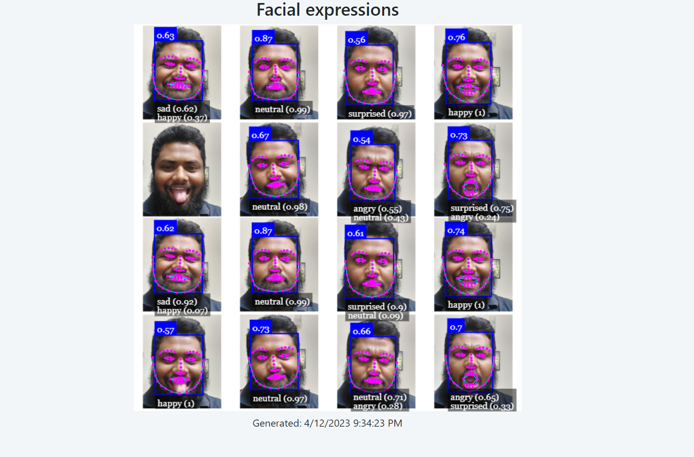

# Face Reaction Detection using face-api.js

Face-api is a JavaScript library that can be used for face detection and recognition tasks. It can also be used to detect facial expressions and emotions.

To detect facial expressions and emotions, face-api uses a neural network model that has been trained on a large dataset of facial images. This model is able to detect features such as the position of the eyes, nose, and mouth, as well as the shape of the face and the movement of facial muscles.

To use face-api for face reaction detection, you can follow these steps:

- Load the necessary libraries and models: You will need to include the face-api library in your project, as well as the models for face detection and expression recognition.

- Capture the video feed: You can use the camera of the user's device to capture a video feed, or you can use pre-recorded video.

- Detect faces: Use the face detection model to identify the faces in the video feed. The face-api library provides a function called "detectAllFaces" that can be used for this purpose.

- Analyze facial expressions: Once faces have been detected, you can use the expression recognition model to analyze the facial expressions of each face. The face-api library provides a function called "detectAllExpressions" that can be used for this purpose.

- Take action based on the results: Based on the facial expressions detected, you can take different actions in your application. For example, you could display a message if a person is smiling, or play a sound effect if a person is frowning.

## Requirements
To run this project, you will need:
- A modern web browser that supports the getUserMedia API (e.g. Chrome, Firefox)
- A computer with a camera (or a pre-recorded video file)

## Demo
clone this project 

``` git clone git@github.com:jmrashed/Face-Reaction-Detection-using-face-api.js.git ```

after clone the project and open `index.html` in your browser. 

## For Live Demo 
open `webcam.html` in your browser

## Example 


After finishing 



## License
This project is licensed under the MIT License. See the LICENSE file for details.

## Acknowledgments
This project was created using the `face-api.js` library, which is developed by `Vincent Mühler` and other contributors. The `face-api.js` library is released under the `MIT License`.


